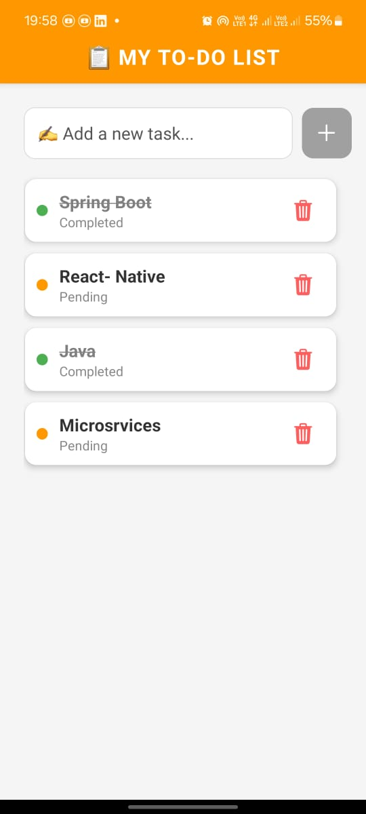

# Welcome to To Do  app 👋

## Image


## Used Technologies
1. React native Expo with file base routing
2. Redux tool kit
3. async-storage
4. reat-native-paper

## Set Up Instruction
1. clone from repository
  `` https://github.com/AElamaran/React-native-ToDo-App.git``
2. Run Following commands
   ```sh
   npm install
   ```
   ```sh
   cd ToDo-App
   ```
    ```sh
    npm install @reduxjs/toolkit react-redux
   ```
   ```sh
   npx expo install @react-native-async-storage/async-storage
   ```
   ```sh
   npx expo install react-native-paper
    ```


4. Run The App

   ```sh
   npx expo start                               
   ```

## Functionalities
 * Add Task
 * Delete Task
 * Toggle functionalities to mark the list

 ## Validations
 * Input field validation
 * Empty list validation
 
 ## Redux Functionalities
 * addTodo: Adds a new todo item 
 * togggleTodoCompletion : Toggle Status of List feedback
 * deleteTodo : Remove the Item from the list
 * loadTodos : Loads the todo from asyncStorage

 ## AsyncThunk
 * All states are go async storage through the asyncThunk. 
 * extraReducers used to achieve this.

 ## Challenges
 * New for Handling redux in file base routing structure.

 


